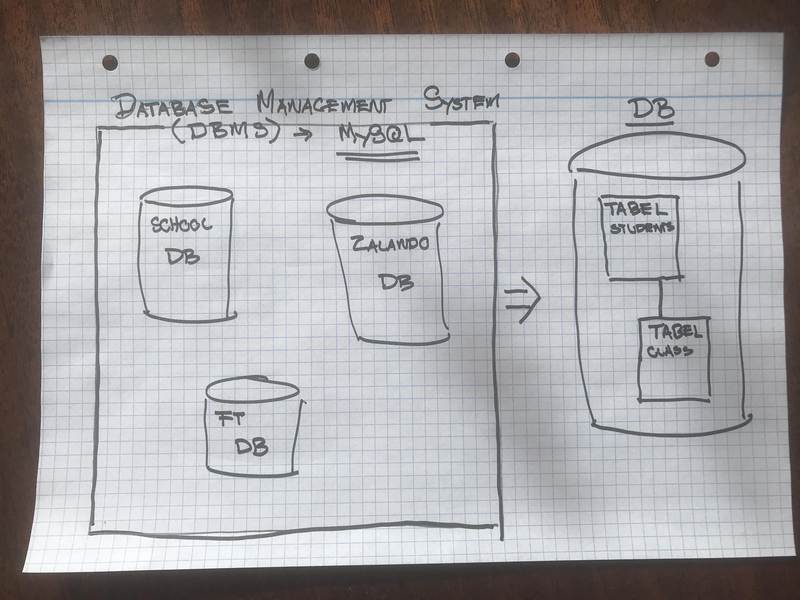
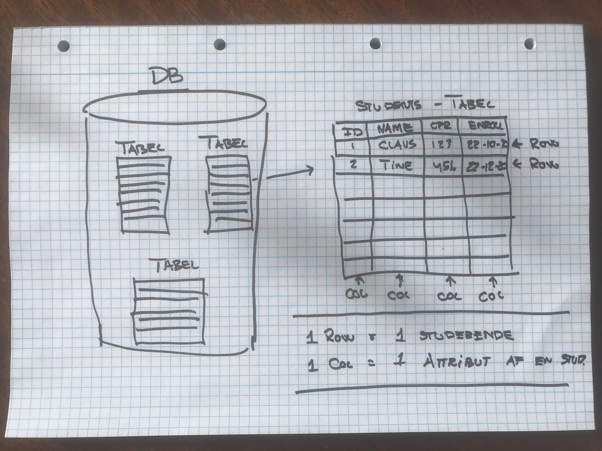
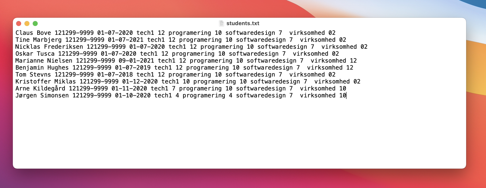

<script src="https://code.jquery.com/jquery-3.2.1.min.js"></script>
<script src="script.js"></script>

# Database Management Systems (DBMS)

## Læringsmål
I studieordningen står der beskrevet at i skal have:    

> udviklingsbaseret viden om tidssvarende operativsystemer og databasesystemer herunder deres opbygning og faciliteter

> anvende centrale faciliteter i databasesystemer og operativsystemer på en hensigtsmæssig måde
     
> i en struktureret sammenhæng tilegne sig ny viden og færdigheder om nye operativsystemer og databasesystemer

**I praksis betyder det at:** 
* I skal have **installeret** MySql og MySql Workbench på jeres maskine. 
* I skal vide hvad et **Database Management System (DBMS)** og hvad en **database** er, og kunne forklare hvad forskellen på disse to er.
* I skal vide hvad **MySql Workbech** er og hvad forkellen på dette, et DBMS og en database er. 
* I skal kunne oprette en **database**, en **tabel** med tilhørende **rækker** af data.
* I skal kende til forskelle og ligeheder mellem at gemme data i en tekstfil og i en database.
* I skal kunne vise hvor databasens filer er gemt på jeres computer. 

## Læringsforløb
* Introduktion og overblik ved Claus
	* Hvad er en database?
* Studiegrupper
	* Installation af MySql og MySql Workbench
		* Følg turorials, hjælp hinanden, og få "besøg af" og "hjælp fra" Claus 
* Setup og gennemgang af MySql og MySql workbench (Claus)
* Studiegrupper
	* MySql og MySql Workbench Øvelser
* Afslutning og gennemgang af øvelser (Claus)

## Materiale
* [What Is MySQL](https://www.mysqltutorial.org/what-is-mysql/)
* [Use MySQL Workbench](https://www.linkedin.com/learning/installing-apache-mysql-and-php-3/use-mysql-workbench-on-windows?u=36836804)
<hr>
**Windows**    

* [Install Mysql and MySQL Workbench tutorial **(8.0.22)**](https://www.mysqltutorial.org/install-mysql/)
	* **VIGTIGT: Når i downloader skal i vælge "Archives" tab og vælge version 8.0.22**
	* [Download MySQL](https://downloads.mysql.com/archives/get/p/25/file/mysql-installer-community-8.0.22.0.msi) 
* [Uninstall MySQL on Windows](https://www.linkedin.com/learning/installing-apache-mysql-and-php-3/install-wampserver?u=36836804)


**Mac**    

* [Install Mysql](https://formulae.brew.sh/formula/mysql)
* [Donwload MySql WorkBench](https://downloads.mysql.com/archives/get/p/8/file/mysql-workbench-community-8.0.22-macos-x86_64.dmg)

Start MySQL:    
```
	$ brew services start mysql
	# eller 
	$ mysql.server start
```
<hr>
### Database Management System (DBMS)


### Database, Table, Collumns, Rows



### Tekstfil med 1 studerenden pr. række


### Database tabel med kolonner (strukturen)


### Database tabel med rækker af data (indhold) (2 studerende)


<hr>
## Øvelser
### School - Students
* Opret en "School" database med en "stududents" tabel med 3 students i denne.
	* Tabellen skal svare til det som du kan se i tekstfilen [herover](https://techkea.github.io/Dat-20-b-og-c-semesterplan/6.html#tekstfil-med-1-studerenden-pr-r%C3%A6kke)

### Zalando
* Opret en "Zalando" database med en "clothes" tabel med 3 stykker tøj i denne.
	* (Du skal finde relevante kolonner (attributter) til dette tøj på [https://www.zalando.dk/](https://www.zalando.dk/))

### Folketinget
* Opret en "Parlament" database med en "parties" tabel med 3 partier i denne.
	* (Du skal finde relevante kolonner (attributter) til disse partier på [https://www.ft.dk/](https://www.ft.dk/))


